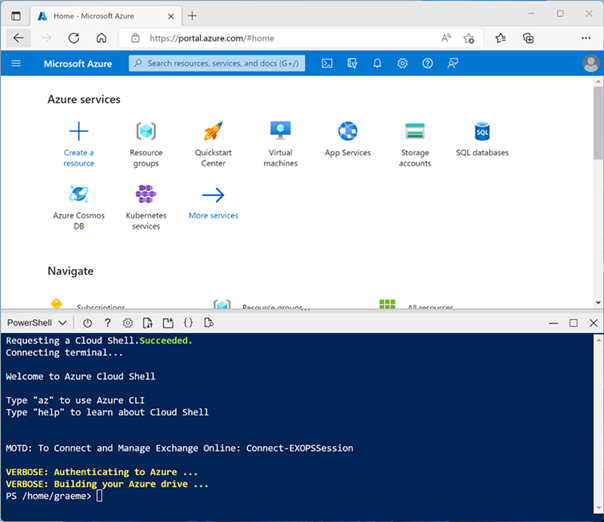

# Azure Synapse Analytics - Hands-on Labs
# LAB 01: Explorer Azure Synapse Analytics
**Durée: 1H**

Azure Synapse Analytics fournit une plateforme d'analyse de données unique et consolidée pour l'analyse de données de bout en bout. Dans cet exercice, vous allez explorer différentes manières d'ingérer et d'explorer des données. Cet exercice est conçu comme une vue d'ensemble de haut niveau des différentes fonctionnalités de base d'Azure Synapse Analytics. D'autres exercices sont disponibles pour explorer plus en détail des fonctionnalités spécifiques.

## Avant de commencer

Vous aurez besoin d'un abonnement Azure dans lequel vous disposez d'un accès de niveau administratif.

## Provisionner un espace de travail Azure Synapse Analytics

Un espace de travail Azure Synapse Analytics fournit un point central pour la gestion des données et des runtimes de traitement des données. Vous pouvez provisionner un espace de travail à l'aide de l'interface interactive du portail Azure, ou vous pouvez déployer un espace de travail et les ressources qu'il contient à l'aide d'un script ou d'un modèle. Dans la plupart des scénarios de production, il est préférable d'automatiser le provisionnement avec des scripts et des modèles afin de pouvoir intégrer le déploiement des ressources dans un processus de développement et d'exploitation (DevOps) reproductible.

Dans cet exercice, vous utiliserez une combinaison d'un script PowerShell et d'un modèle ARM pour provisionner Azure Synapse Analytics.
1. Dans un navigateur Web, connectez-vous au portail Azure à l'adresse https://portal.azure.com.
2. Utilisez le bouton [>_] à droite de la barre de recherche en haut de la page pour créer un nouveau Cloud Shell dans le portail Azure, en sélectionnant un environnement PowerShell.
3. Créer un stockage si vous y êtes invité. 
 


4. Le cloud shell fournit une interface de ligne de commande dans un volet au bas du portail Azure, comme illustré ici :


5. Si vous avez déjà créé un cloud shell qui utilise un environnement Bash, utilisez le menu déroulant en haut à gauche du volet cloud shell pour le remplacer par PowerShell.
6. Notez que vous pouvez redimensionner le cloud shell en faisant glisser la barre de séparation en haut du volet ou en utilisant les icônes —, ◻ et X en haut à droite du volet pour réduire, agrandir et fermer le volet.
7. Dans le volet PowerShell, saisissez les commandes suivantes pour cloner ce référentiel :

```
rm -r synapse –f
git clone https://github.com/SBSsbs/Azure-Synapse-Analytics.git synapse
```
 
8. Une fois le référentiel cloné, saisissez les commandes suivantes pour accéder au dossier de cet exercice et exécutez le script setup.ps1 qu'il contient :

```
cd './synapse/Lab 01/01'
./setup.ps1
```

9. Si vous y êtes invité, choisissez l'abonnement que vous souhaitez utiliser (cela ne se produira que si vous avez accès à plusieurs abonnements Azure).
10. Lorsque vous y êtes invité, entrez un mot de passe approprié à définir pour votre pool SQL Azure Synapse.
11. Attendez que le script se termine - cela prend généralement environ 20 minutes, mais dans certains cas, cela peut prendre plus de temps.

Dans cette partie du lab, nous allons provisionner automatiquement l’ensemble de l’environnement Azure Synapse Analytics qui sera utilisé tout au long de l'exercie. Cette tâche consiste à exécuter un script PowerShell qui déploie, via de l’Infrastructure as Code, toutes les ressources nécessaires à un scénario Data Engineering complet : un **Data Lake Azure (ADLS Gen2)** pour le stockage des données, un **workspace Synapse** servant de point central d’orchestration, un **Spark pool** pour les traitements distribués, ainsi qu’un **Dedicated SQL pool** jouant le rôle de couche Data Warehouse. 

Le script configure également les droits d’accès (**RBAC**) entre les services, initialise le **schéma analytique** (tables de faits et de dimensions) et charge des jeux de données de référence. 

L’objectif n’est pas seulement de disposer d’un environnement prêt à l’emploi, mais surtout de comprendre ce qui est déployé en arrière-plan, comment les différents composants interagissent, et pourquoi ces choix correspondent à une architecture Data Engineering moderne et industrialisable.

## 1. Mise en place de l’environnement du lab avec le script PowerShell##


``` Clear-Host ```: cette action permet de nettoyer la console et donc améliorer la lisibilité pendant une démo/lab.

```write-host "Starting script at $(Get-Date)"```: il s'agit d'un log de démarrage avec horodatage pour permettre la traçabilité (utile quand plusieurs participants exécutent le setup).

```Set-PSRepository -Name PSGallery -InstallationPolicy Trusted```: définit PSGallery comme “Trusted” ce qui évite les prompts interactifs au moment d’installer des modules → exécution fluide en salle.

```Install-Module -Name Az.Synapse -Force```: permet d'installer le module PowerShell Az.Synapse. Il s'agit d'un module client pour piloter Synapse via PowerShell ce qui illustre l’automatisation (scripts/IaC) : on ne clique pas dans le portail, on industrialise.

### 2. Gestion du contexte Azure (abonnement)##

``` Get-AzSubscription```: Cette commande permet de lister les subscriptions accessibles par l’utilisateur. Dans un contexte de formation, certains participants peuvent avoir plusieurs abonnements (perso + pro + sandbox) surtout si aucun abonnement n'est propos dans le cadre de la formation. Ceci permet d'éviter de déployer “au mauvais endroit”. On ajoute alors à notre code PowerShell, un bloc de sélection qui permet de choisir la subscription à utiliser. Le script va alors afficher la liste (```Name```, ```Id```), demande à l'utilisateur de sélectionner un index et le lire comme argument en utilisant la commande ```Read-Host```, le valide s'il est correcte puis applique le contexte en utilisant les instructions suivantes: 

```
Select-AzSubscription -SubscriptionId $selectedSub
az account set --subscription $selectedSub
```
## 3. Saisie et validation du mot de passe SQL##

Il s'agit d'une boucle de saisie où le script impose déjà un nom d'utilisateur ```$sqlUser = "SQLUser" ``` demande un mot de passe ```$sqlPassword``` avec une complexité : min 8 caractères, 1 majuscule, 1 minuscule, 1 chiffre et 1 caractère spécial parmi ! @ # % ^ & $. Ce login/mot de passe sert ensuite à se connecter au endpoint SQL de Synapse (Dedicated SQL pool / SQL database dans le workspace). Ceci permet de manipuler SQL, charger des données et exécuter des scripts sans dépendre d’Azure AD au départ.

## 4. Enregistrement des Resource Providers Azure##

```
$provider_list = "Microsoft.Synapse", "Microsoft.Sql", "Microsoft.Storage", "Microsoft.Compute"
foreach ($provider in $provider_list){
    Register-AzResourceProvider -ProviderNamespace $provider
}
```

Ces instructions permettent d'activer les providers dans la subscription si nécessaire. Ceci permet d'éviter les échecs de déploiement ARM/Bicep du type “The subscription is not registered to use namespace …” ce qui est important lorsqu'il s'agit de manipuler en environnement “neuf” (sandbox formation, nouvel abonnement)

## 5. Génération d’un suffixe unique pour nommer les ressources##
```
[string]$suffix = -join ((48..57) + (97..122) | Get-Random -Count 7 | % {[char]$_})
$resourceGroupName = "semeh-$suffix"
```

Ces instructions génèrent un suffixe aléatoire (chiffres + lettres minuscules). Avec Azure, beaucoup de noms doivent être globalement uniques (ex: storage account). Dans un contexte de formation, 20 personnes qui créent “datalake” sur le même abonnement peut engendrer des collisions assurées. Le suffixe évite ça.

Ressources nommées (plus bas) :

- RG : semeh-<suffix>
- Synapse : synapse<suffix>
- Storage : datalake<suffix>
- Spark pool : spark<suffix>
- SQL database/pool : sql<suffix>

## 6. Sélection d’une région Azure “compatible”##

En utilisant ce script, on attend un délai aléatoire (0/30/60/90/120s) pour “stagger” les déploiements en classe. puis, on filtre les régions où les providers nécessaires sont disponibles
et on choisit une région dans une liste préférée. En effet, Synapse n’est pas disponible partout. Certaines régions peuvent être saturées (quotas/stock) pendant une formation. On essaie alors avec ce bloc d'instructions de trouver une région déployable. Ou bien on peut spécifier le nom de la région souhaitée comme argument à l'instruction initiale qui lance le script en choisissant la région comme northeurope, westeurope, etc.

```
Start-Sleep -Seconds $delay
$locations = Get-AzLocation | Where-Object { ... }
```

## 7. Création du Resource Group##

```
New-AzResourceGroup -Name $resourceGroupName -Location $Region | Out-Null
```

Avec cette action on va créer le Ressource Group (RG). Ceci permet de regrouper toutes les ressources Synapse + Storage + compute.

## 8. Déploiement principal via un ARM template (setup.json)##

L'étape suivante consiste à déployer l’infrastructure décrite dans le fichier ```setup.json``` en utilisant les instructions suivantes:

```
New-AzResourceGroupDeployment -ResourceGroupName $resourceGroupName `
  -TemplateFile "setup.json" `
  -Mode Complete `
  -workspaceName $synapseWorkspace `
  -dataLakeAccountName $dataLakeAccountName `
  -sparkPoolName $sparkPool `
  -sqlDatabaseName $sqlDatabaseName `
  -sqlUser $sqlUser `
  -sqlPassword $sqlPassword `
  -uniqueSuffix $suffix `
  -Force
```
Les ressources qui seront crées dans cette infrastructure sont les suivantes:
- Azure Synapse Workspace: ```$synapseWorkspace = "synapse$suffix"```
- ADLS Gen2 / Storage Account ```(Data Lake): $dataLakeAccountName = "datalake$suffix"```
- Spark pool (Synapse Spark): ```$sparkPool = "spark$suffix"```
- Dedicated SQL pool ou base SQL dans Synapse: ```$sqlDatabaseName = "sql$suffix"```

## 9. (Optionnel / commenté) Data Explorer (Kusto) pool##
```
#Stop-AzSynapseKustoPool ...
```

Cette instruction (commenté) permet de stopper ou mettre en pause le pool Data Explorer. En effet, la partie Data Explorer (KQL) coûte et n’est pas toujours nécessaire pour cet exercice.

## 10. Attribution de rôles RBAC sur le Data Lake##
```
$subscriptionId = (Get-AzContext).Subscription.Id
$userName = ((az ad signed-in-user show) | ConvertFrom-JSON).UserPrincipalName
$id = (Get-AzADServicePrincipal -DisplayName $synapseWorkspace).id
New-AzRoleAssignment -Objectid $id -RoleDefinitionName "Storage ...ageAccounts/$dataLakeAccountName" ...
New-AzRoleAssignment -SignInName $userName -RoleDefinitionName "...ageAccounts/$dataLakeAccountName" ...
```

Avec ces instruction, on récupère l’utilisateur connecté (UserPrincipalName) et aussi le Service Principal / Managed Identity lié à Synapse (affiché comme service principal). Par la suite, on attribue des rôles RBAC sur le storage account. ceci est essentiel pour que Synapse (pipelines, Spark, SQL) puisse lire/écrire dans le Data Lake et pour que l’utilisateur puisse manipuler les données (upload, exploration, debug).

## 11. Création du schéma SQL via sqlcmd (setup.sql)##

```
sqlcmd -S "$synapseWorkspace.sql.azuresynapse.net" -U $sqlUser -P $sqlPassword -d $sqlDatabaseName -I -i setup.sql
```

Cette commande permet d'exécuter le script ```setup.sql``` sur l’endpoint SQL de Synapse ```*.sql.azuresynapse.net``` en utilisant la base/pool cible : ```$sqlDatabaseName```. Ceci permet de mettre en place la couche “serving / warehouse” : tables, schémas, objets nécessaires au lab. Ceci rend le lab reproductible : pas de création manuelle de tables.

## 12. Chargement des données dans SQL via bcp##

```
Get-ChildItem "./data/*.txt" -File | Foreach-Object {
    $file = $_.FullName
    $table = $_.Name.Replace(".txt","")
    bcp dbo.$table in $file -S "<server>" -U $sqlUser -P $sqlPassword -d $sqlDatabaseName -f <formatfile> ...
}

```
Pour chaque fichier ```.txt``` dans le répertoire ```./data/```, on récupère le nom de la table (même nom que le fichier), on charge en bulk dans ```dbo.<table>``` via bcp en utilisant le un fichier .fmt (format) associé. Cette opération illustre une approche “bulk load” (ingestion rapide) vers une couche SQL analytique. En pratique, on ferait souvent COPY INTO / PolyBase / pipelines, mais bcp est très utile pour un setup rapide de lab.

## 13. Pause du SQL Pool (optimisation des coûts)##
```
Suspend-AzSynapseSqlPool -WorkspaceName $synapseWorkspace -Name $sqlDatabaseName -AsJob
```

Cette instruction met en pause le pool SQL (dedicated). Ceci est très important en formation : un Dedicated SQL Pool coûte tant qu’il est “online”. Ceci démontre également une bonne pratique FinOps : arrêter quand non utilisé.

## 14. Upload de fichiers CSV dans le Data Lake (container files)##
```
$storageAccount = Get-AzStorageAccount -ResourceGroupName $resourceGroupName -Name $dataLakeAccountName
$storageContext = $storageAccount.Context

Get-ChildItem "./files/*.csv" -File | Foreach-Object {
    $blobPath = "sales_data/$($_.Name)"
    Set-AzStorageBlobContent -File $_.FullName -Container "files" -Blob $blobPath -Context $storageContext
}
```

Avec ces instruction, on récupère le storage account et son contexte. On charge ensuite tous les .csv vers le container ```files``` et on les place sous un “répertoire logique” : ```sales_data/```. Ceci constitue la zone “landing / raw” (même si ici on charge directement dans un container). Ces fichiers seront par la suite utilisés pour alimenter les labs Spark / serverless SQL / pipelines (lecture depuis ADLS).

## 15. Création d’un script KQL (commenté)##
```
# New-AzSynapseKqlScript -WorkspaceName $synapseWorkspace -DefinitionFile "./files/ingest-data.kql"
```
Il s'agit d'une instruction commentée dans le script qu'on aurait pu utiliser pour déployer un script KQL dans Synapse (Data Explorer). ceci nous permet d'initialiser du contenu KQL pour ingestion/queries.

Ce script PowerShell exécuté se présente comme un pipeline d’industrialisation permettant de:
- Préparer l’outil (modules, providers)
- Sécuriser le contexte (bonne subscription)
- Paramétrer l’accès SQL (login + password)
- Déployer l’infrastructure (template ARM)
- Donner les droits (RBAC user + Synapse)
- Initialiser la couche warehouse (setup.sql)
- Charger des données (bcp)
- Optimiser les coûts (pause SQL pool)
- Préparer la zone data lake (upload CSV)

## Découvrez Synapse Studio

Synapse Studio est un portail Web dans lequel vous pouvez gérer et utiliser les ressources de votre espace de travail Azure Synapse Analytics.
12. Une fois l'exécution du script d'installation terminée, dans le portail Azure, accédez au groupe de ressources dp203-xxxxxxx qu'il a créé et notez que ce groupe de ressources contient votre espace de travail Synapse.
 
13. Un compte de stockage pour votre lac de données, un pool Apache Spark (Apache Spark pool), un Pool d'explorateur de données (Data Explorer pool) et un pool SQL dédié (Dedicated SQL pool).
 
14. Sélectionnez votre espace de travail Synapse et, dans sa page Overview, dans la carte Open Synapse Studio, sélectionnez Open pour ouvrir Synapse Studio dans un nouvel onglet du navigateur. 
 
Synapse Studio est une interface Web que vous pouvez utiliser pour travailler avec votre espace de travail Synapse Analytics.
15. Sur le côté gauche de Synapse Studio, utilisez l'icône ›› pour développer le menu - cela révèle les différentes pages de Synapse Studio que vous utiliserez pour gérer les ressources et effectuer des tâches d'analyse de données, comme illustré ici :
 
16. Affichez la page Données (Data) et notez qu'il existe deux onglets contenant des sources de données :
─	Un onglet Workspace contenant les bases de données définies dans l'espace de travail (y compris les bases de données SQL dédiées et les bases de données Data Explorer).
─	Un onglet Linked contenant des sources de données liées à l'espace de travail, y compris le stockage Azure Data Lake.
      
17. Affichez la page Develop. C'est ici que vous pouvez définir des scripts et d'autres actifs utilisés pour développer des solutions de traitement de données.
18. Affichez la page Integrate. Vous utilisez cette page pour gérer les actifs d'ingestion et d'intégration de données ; tels que des pipelines pour transférer et transformer des données entre des sources de données.
19. Affichez la page Monitor. C'est ici que vous pouvez observer les travaux de traitement de données pendant leur exécution et afficher leur historique.
20. Affichez la page Manage. C'est là que vous gérez les pools, les runtimes et les autres actifs utilisés dans votre espace de travail Azure Synapse. Voir chacun des onglets de la section Pools Analytics et notez que votre espace de travail comprend les pools suivants :
─	Pools SQL :
o	Intégré : un pool SQL sans serveur que vous pouvez utiliser à la demande pour explorer ou traiter des données dans un lac de données à l'aide de commandes SQL.
o	sqlxxxxxxx : un pool SQL dédié qui héberge une base de données d'entrepôt de données relationnelles.
─	Groupes Apache Spark :
o	sparkxxxxxxx : que vous pouvez utiliser à la demande pour explorer ou traiter des données dans un lac de données en utilisant des langages de programmation comme Scala ou Python.
─	Pools d'explorateur de données :
o	adxxxxxxxx : un pool d'explorateurs de données que vous pouvez utiliser pour analyser les données à l'aide du langage de requête Kusto (KQL).
 
Ingérer des données avec un pipeline
L'une des principales tâches que vous pouvez effectuer avec Azure Synapse Analytics consiste à définir des pipelines qui transfèrent (et si nécessaire, transforment) les données d'un large éventail de sources dans votre espace de travail pour analyse.
Utiliser la tâche Data Copy pour créer un pipeline
21. Dans Synapse Studio, sur la page Home, sélectionnez Ingest pour ouvrir l'outil Copy Data.
 
22. Dans l'outil Copy Data, à l'étape Propriétés, assurez-vous que Built-in copy task et Run once now sont sélectionnés, puis cliquez sur Suivant >.
  
23. À l'étape Source, dans la sous-étape Dataset, sélectionnez les paramètres suivants :
─	Type de source : Tous
─	Connexion : Créez une nouvelle connexion et dans le volet linked services qui s'affiche, sous l'onglet Fichier, sélectionnez HTTP. 
 
24. Continuez ensuite et créez une connexion à un fichier de données en utilisant les paramètres suivants :
─	Nom : Products
─	Description : liste de produits via http
─	Connectez-vous via le runtime d'intégration : AutoResolveIntegrationRuntime
─	URL de base : https://raw.githubusercontent.com/MicrosoftLearning/dp-203-azure-data-engineer/master/Allfiles/labs/01/adventureworks/products.csv
─	Validation du certificat du serveur : Activer
─	Type d'authentification : Anonyme
 
25. Avant de créer la connexion on peut la vérifier en utilisant le bouton Tester la connexion.
26. Après avoir créé la connexion, sur la page Magasin de données source (Source data store), assurez-vous que les paramètres suivants sont sélectionnés, puis sélectionnez Suivant > :
─	URL relative : laisser vide
─	Méthode de requête : GET
─	En-têtes supplémentaires : laissez vide
─	Copie binaire : non sélectionnée
─	Délai d'expiration de la demande : laissez le champ vide
─	Nombre maximal de connexions simultanées : laissez le champ vide
27. À l'étape Source, dans la sous-étape Configuration, sélectionnez Aperçu des données pour afficher un aperçu des données produit que votre pipeline va ingérer, puis fermez l'aperçu.
 
28. Après avoir pré-visualisé les données, sur la page Paramètres du format de fichier, assurez-vous que les paramètres suivants sont sélectionnés, puis sélectionnez Suivant > :
─	Format de fichier : texte délimité
─	Délimiteur de colonne : virgule (,)
─	Délimiteur de ligne : saut de ligne (\n)
─	Première ligne comme en-tête : sélectionné
─	Type de compression : Aucun
29. À l'étape Destination, dans la sous-étape Dataset, sélectionnez les paramètres suivants :
─	Type de destination : Azure Data Lake Storage Gen 2
─	Connexion : sélectionnez la connexion existante à votre magasin de lac de données (celle-ci a été créée pour vous lorsque vous avez créé l'espace de travail).
30. Après avoir sélectionné la connexion, à l'étape Destination/Jeu de données, assurez-vous que les paramètres suivants sont sélectionnés, puis sélectionnez Suivant > :
─	Chemin du dossier : files/product_data
─	Nom du fichier : produits.csv
─	Comportement de copie : aucun
─	Nombre maximal de connexions simultanées : laissez le champ vide
─	Taille du bloc (Mo) : Laisser vide
31. À l'étape Destination, à la sous-étape Configuration, sur la page Paramètres du format de fichier, assurez-vous que les propriétés suivantes sont sélectionnées. Sélectionnez ensuite Suivant > :
─	Format de fichier : texte délimité
─	Délimiteur de colonne : virgule (,)
─	Délimiteur de ligne : saut de ligne (\n)
─	Ajouter un en-tête au fichier : Sélectionné
─	Type de compression : Aucun
─	Nombre maximum de lignes par fichier : laissez vide
─	Préfixe du nom de fichier : laissez vide
32. À l'étape Paramètres, saisissez les paramètres suivants, puis cliquez sur Suivant > :
─	Nom de la tâche : copier des produits
─	Description de la tâche : Copier les données des produits
─	Tolérance aux pannes : laisser vide
─	Activer la journalisation : non sélectionné
─	Activer la mise en scène : non sélectionné
33. À l'étape Réviser et terminer, à la sous-étape Réviser, lisez le résumé, puis cliquez sur Suivant >.
34. À l'étape Déploiement, attendez que le pipeline soit déployé, puis cliquez sur Terminer.
 
35. Dans Synapse Studio, sélectionnez la page Monitor, et dans l'onglet Pipeline runs, attendez que le pipeline Copy products se termine avec un statut Réussi (vous pouvez utiliser le bouton ↻ Refresh sur la page Pipeline runs pour actualiser le statut).
36. Affichez la page Intégrer et vérifiez qu'elle contient désormais un pipeline nommé Copier les produits.
 
Afficher les données ingérées
37. Sur la page Données, sélectionnez l'onglet Linked et développez la hiérarchie Azure Data Lake Storage Fichiers produit jusqu'à ce que vous voyiez le stockage des fichiers pour votre espace de travail Synapse. Sélectionnez ensuite le stockage de fichiers pour vérifier qu'un dossier nommé product_data contenant un fichier nommé products.csv a été copié à cet emplacement, comme illustré ici :
 
38. Cliquez avec le bouton droit sur le fichier de données products.csv et sélectionnez Aperçu pour visualiser les données ingérées. Fermez ensuite l'aperçu.
 
Utiliser un pool SQL sans serveur pour analyser les données
Maintenant que vous avez ingéré des données dans votre espace de travail, vous pouvez utiliser Synapse Analytics pour les interroger et les analyser. L'une des façons les plus courantes d'interroger des données consiste à utiliser SQL, et dans Synapse Analytics, vous pouvez utiliser un pool SQL sans serveur pour exécuter du code SQL sur des données dans un lac de données.
39. Dans Synapse Studio, cliquez avec le bouton droit sur le fichier products.csv dans le stockage de fichiers de votre espace de travail Synapse, pointez sur Nouveau script SQL et sélectionnez Sélectionner les 100 premières lignes.
 
40. Dans le volet SQL Script 1 qui s'ouvre, passez en revue le code SQL qui a été généré, qui devrait ressembler à ceci :
-- This is auto-generated code
 SELECT
     TOP 100 *
 FROM
     OPENROWSET(
        BULK 'https://datalakexxxxxxx.dfs.core.windows.net/files/product_data/products.csv',
         FORMAT = 'CSV',
         PARSER_VERSION='2.0'
     ) AS [result]
41. Ce code ouvre un ensemble de lignes à partir du fichier texte que vous avez importé et récupère les 100 premières lignes de données.
42. Dans la liste Connect to (Se connecter à), assurez-vous que Built-in est sélectionné - cela représente le pool SQL intégré qui a été créé avec votre espace de travail.
 
43. Dans la barre d'outils, utilisez le bouton ▷ Exécuter pour exécuter le code SQL et examinez les résultats, qui devraient ressembler à ceci :
 
44. Notez que les résultats se composent de quatre colonnes nommées C1, C2, C3 et C4 ; et que la première ligne des résultats contient les noms des champs de données. Pour résoudre ce problème, ajoutez un paramètre HEADER_ROW = TRUE à la fonction OPENROWSET comme illustré ici (en remplaçant datalakexxxxxxx par le nom de votre compte de stockage de lac de données), puis relancez la requête :
SELECT
     TOP 100 *
 FROM
     OPENROWSET(
         BULK 'https://datalakexxxxxxx.dfs.core.windows.net/files/product_data/products.csv',
         FORMAT = 'CSV',
         PARSER_VERSION='2.0',
         HEADER_ROW = TRUE
     ) AS [result]
45. Maintenant, les résultats ressemblent à ceci :
 
46. Modifiez la requête comme suit (en remplaçant datalakexxxxxxx par le nom de votre compte de stockage de lac de données) :
SELECT
     Category, COUNT(*) AS ProductCount
 FROM
     OPENROWSET(
         BULK 'https://datalakexxxxxxx.dfs.core.windows.net/files/product_data/products.csv',
         FORMAT = 'CSV',
         PARSER_VERSION='2.0',
         HEADER_ROW = TRUE
     ) AS [result]
 GROUP BY Category;
47. Exécutez la requête modifiée, qui devrait renvoyer un jeu de résultats contenant le nombre de produits dans chaque catégorie, comme ceci :
 
48. Dans le volet Propriétés de SQL Script 1, remplacez le nom par Count Products by Category. 
49. Ensuite, dans la barre d'outils, sélectionnez Publier pour enregistrer le script.
50. Fermez le volet de script Count Products by Category.
51. Dans Synapse Studio, sélectionnez la page Développer et notez que votre script SQL Count Products by Category publié y a été enregistré.
52. Sélectionnez le script SQL Count Products by Category pour le rouvrir. Assurez-vous ensuite que le script est connecté au pool SQL intégré et exécutez-le pour récupérer le nombre de produits.
53. Dans le volet Résultats, sélectionnez la vue Graphique, puis sélectionnez les paramètres suivants pour le graphique :
─	Type de graphique : Colonne
─	Colonne Catégorie : Catégorie
─	Colonnes de légende (série) : ProductCount
─	Position de la légende : bas – centre
─	Étiquette de légende (série) : Laisser vide
─	Légende (série) valeur minimale : Laisser vide
─	Légende (série) maximum : Laisser vide
─	Libellé de la catégorie : laisser vide
     Le graphique résultant devrait ressembler à ceci :
 
Utiliser un pool Spark pour analyser les données
Alors que SQL est un langage courant pour interroger des ensembles de données structurés, de nombreux analystes de données trouvent des langages comme Python utiles pour explorer et préparer les données pour l'analyse. Dans Azure Synapse Analytics, vous pouvez exécuter du code Python (et autre) dans un pool Spark ; qui utilise un moteur de traitement de données distribué basé sur Apache Spark.
54. Dans Synapse Studio, si l'onglet Fichiers que vous avez ouvert précédemment contenant le fichier products.csv n'est plus ouvert, sur la page Données, parcourez le dossier product_data. 
55. Cliquez ensuite avec le bouton droit sur products.csv, pointez sur Nouveau bloc-notes et sélectionnez Charger dans DataFrame.
 
56. Dans le volet Bloc-notes 1 qui s'ouvre, dans la liste Attacher à, sélectionnez le pool Spark xxxxxxxx et assurez-vous que la langue est définie sur PySpark (Python).
 
57. Passez en revue le code dans la première (et unique) cellule du bloc-notes, qui devrait ressembler à ceci :
%%pyspark
df = spark.read.load('abfss://files@datalakeex24n6q.dfs.core.windows.net/product_data/produits.csv', format='csv'
## If header exists uncomment line below
##, header=True
)
display(df.limit(10))
58. Utilisez l'icône ▷ à gauche pour l'exécuter, et attendez les résultats. 
59. La première fois que vous exécutez une cellule dans un bloc-notes, le pool Spark est démarré. Cela peut donc prendre environ une minute pour renvoyer des résultats.
60. Finalement, les résultats devraient apparaître sous la cellule, et ils devraient ressembler à ceci :
 
61. Dé-commentez la ligne, header=True (car le fichier products.csv a les en-têtes de colonne sur la première ligne).
62. Ré-exécutez la cellule et vérifiez que les résultats ressemblent à ceci :
 
63. Notez que la réexécution de la cellule prend moins de temps, car le pool Spark est déjà démarré.
64. Sous les résultats, utilisez l'icône ＋ Code pour ajouter une nouvelle cellule de code au bloc-notes.
65. Dans la nouvelle cellule de code vide, ajoutez le code suivant :
      df_counts = df.groupby(df.Category).count()
      display(df_counts)
66. Exécutez la nouvelle cellule de code en cliquant sur son icône ▷ et examinez les résultats, qui devraient ressembler à ceci :
 
67. Dans la sortie des résultats de la cellule, sélectionnez-la vue Graphique. Le graphique résultant devrait ressembler à ceci :
 
68. Si elle n'est pas déjà visible, affichez la page Propriétés en sélectionnant le bouton Propriétés à l'extrémité droite de la barre d'outils. 
69. Ensuite, dans le volet Propriétés, modifiez le nom du bloc-notes en Explorer les produits et utilisez le bouton Publier de la barre d'outils pour l'enregistrer.
70. Fermez le volet du bloc-notes et arrêtez la session Spark lorsque vous y êtes invité. Affichez ensuite la page Développer pour vérifier que le bloc-notes a été enregistré.
Utiliser un pool SQL dédié pour interroger un entrepôt de données
Jusqu'à présent, vous avez vu quelques techniques d'exploration et de traitement de données basées sur des fichiers dans un lac de données. Dans de nombreux cas, une solution d'analyse d'entreprise utilise un lac de données pour stocker et préparer des données non structurées qui peuvent ensuite être chargées dans un entrepôt de données relationnelles pour prendre en charge les charges de travail de Business Intelligence (BI). Dans Azure Synapse Analytics, ces entrepôts de données peuvent être implémentés dans un pool SQL dédié.
71. Dans Synapse Studio, sur la page Manage, dans la section Pools SQL, sélectionnez la ligne du pool SQL dédié sqlxxxxxxx
72. Utilisez son icône ▷ pour le reprendre.
 
73. Attendez que le pool SQL démarre. Cela peut prendre quelques minutes. Utilisez le bouton ↻ Actualiser pour vérifier périodiquement son état. L'état s'affichera comme Online lorsqu'il sera prêt.
74. Lorsque le pool SQL a démarré, sélectionnez la page Data.
75. Dans l'onglet Espace de travail, développez les bases de données SQL et vérifiez que sqlxxxxxxx est répertorié (utilisez l'icône ↻ en haut à gauche de la page pour actualiser la vue si nécessaire).
 
76. Développez la base de données sqlxxxxxxx et son dossier Tables, puis dans le menu … de la table FactInternetSales, pointez sur Nouveau script SQL et sélectionnez Sélectionner les 100 premières lignes.
 
77. Examinez les résultats de la requête, qui affichent les 100 premières transactions de vente dans le tableau. Ces données ont été chargées dans la base de données par le script d'installation et sont stockées en permanence dans la base de données associée au pool SQL dédié.
78. Remplacez la requête SQL par le code suivant :
     SELECT d.CalendarYear, d.MonthNumberOfYear, d.EnglishMonthName,
        p.EnglishProductName AS Product, SUM(o.OrderQuantity) AS UnitsSold
 FROM dbo.FactInternetSales AS o
 JOIN dbo.DimDate AS d ON o.OrderDateKey = d.DateKey
 JOIN dbo.DimProduct AS p ON o.ProductKey = p.ProductKey
 GROUP BY d.CalendarYear, d.MonthNumberOfYear, d.EnglishMonthName, p.EnglishProductName
 ORDER BY d.MonthNumberOfYear
79. Utilisez le bouton ▷ Exécuter pour exécuter la requête modifiée, qui renvoie la quantité de chaque produit vendu par année et par mois.
 
80. Si elle n'est pas déjà visible, affichez la page Propriétés en sélectionnant le bouton Propriétés à l'extrémité droite de la barre d'outils. 
81. Ensuite, dans le volet Propriétés, modifiez le nom de la requête en Aggregate product sales.
82. Utilisez le bouton Publier de la barre d'outils pour l'enregistrer.
83. Fermez le volet de requête, puis affichez la page Develop pour vérifier que le script SQL a été enregistré.
84. Sur la page Manage, sélectionnez la ligne du pool SQL dédié sqlxxxxxxx et utilisez son icône ❚❚ pour la mettre en pause.
Explorer les données avec un pool d'explorateur de données
Azure Synapse Data Explorer fournit un environnement d'exécution que vous pouvez utiliser pour stocker et interroger des données à l'aide du langage de requête Kusto (KQL). Kusto est optimisé pour les données qui incluent un composant de série chronologique, telles que les données en temps réel provenant de fichiers journaux ou d'appareils IoT.
Créer une base de données Data Explorer et ingérer des données dans une table
85. Dans Synapse Studio, sur la page Manage, dans le pool Data Explorer pools, sélectionnez la ligne du pool adxxxxxxxx, puis utilisez son icône ▷ pour la reprendre.
86. Attendez que le pool démarre. Cela peut prendre un certain temps. Utilisez le bouton ↻ Actualiser pour vérifier périodiquement son état. Le statut s'affichera comme en ligne lorsqu'il sera prêt.
87. Lorsque le pool de l'explorateur de données a démarré, affichez la page Data; et dans l'onglet Espace de travail, développez Bases de données de l'explorateur de données et vérifiez que adxxxxxxxx est répertorié (utilisez l'icône ↻ en haut à gauche de la page pour actualiser la vue si nécessaire)
88. Dans le volet Data, utilisez l'icône ＋ pour créer une nouvelle base de données Data Explorer dans le pool adxxxxxxxx avec le nom sales-data.
 
89. Dans Synapse Studio, attendez que la base de données soit créée (une notification s'affichera).
90. Passez à la page Develop et, dans la liste des scripts KQL, sélectionnez ingest-data. Lorsque le script s'ouvre, notez qu'il contient deux instructions :
─	Une instruction .create table pour créer une table nommée sales.
─	Une instruction .ingest into table pour charger des données dans la table à partir d'une source HTTP.
91. Dans le volet ingest-data, dans la liste Connect to, sélectionnez votre pool adxxxxxxxx, et dans la liste Database, sélectionnez sales-data.
 
92. Dans le script, mettez en surbrillance l'instruction .create table, puis dans la barre d'outils, utilisez le bouton ▷ Run pour exécuter le code sélectionné, ce qui crée une table nommée sales.
93. Une fois la table créée, mettez en surbrillance l'instruction .ingest into table et utilisez le bouton ▷ Run pour l'exécuter et ingérer les données dans la table.
94. Dans cet exemple, vous avez importé une très petite quantité de données de lot à partir d'un fichier, ce qui convient aux fins de cet exercice. En réalité, vous pouvez utiliser Data Explorer pour analyser des volumes de données beaucoup plus importants ; y compris les données en temps réel d'une source de diffusion telle qu'Azure Event Hubs.
Utiliser le langage de requête Kusto pour interroger la table
95. Revenez à la page Data et dans le menu … de la base de données des données sales-data, sélectionnez Actualiser.
 
96. Développez le dossier Tables de la base de données des données sales-data. 
97. Ensuite, dans le menu … de la table des ventes, sélectionnez Nouveau script KQL > Prendre 1000 lignes.
 
98. Passez en revue la requête générée et ses résultats. La requête doit contenir le code suivant :
     sales
 | take 1000
99. Les résultats de la requête contiennent les 1 000 premières lignes de données.
 
100. Modifiez la requête comme suit :
sales
 | where Item == 'Road-250 Black, 48'
101.  Utilisez le bouton ▷ Exécuter pour exécuter la requête. 
102. Examinez ensuite les résultats, qui ne doivent contenir que les lignes des bons de commande pour le produit Road-250 Black, 48.
103. Modifiez la requête comme suit :
sales
 | where Item == 'Road-250 Black, 48'
 | where datetime_part('year', OrderDate) > 2020
104.  Exécutez la requête et examinez les résultats, qui ne doivent contenir que des commandes client pour Road-250 Black, 48 effectuées après 2020.
105. Modifiez la requête comme suit :
sales
 | where OrderDate between (datetime(2020-01-01 00:00:00) .. datetime(2020-12-31 23:59:59))
 | summarize TotalNetRevenue = sum(UnitPrice) by Item
 | sort by Item asc
106. Exécutez la requête et examinez les résultats, qui doivent contenir le revenu net total pour chaque produit entre le 1er janvier et le 31 décembre 2020, par ordre croissant de nom de produit.
107. Si elle n'est pas déjà visible, affichez la page Propriétés en sélectionnant le bouton Propriétés à l'extrémité droite de la barre d'outils. 
108. Ensuite, dans le volet Propriétés, modifiez le nom de la requête en Explore sales data de vente et utilisez le bouton Publier de la barre d'outils pour l'enregistrer.
109. Fermez le volet de requête, puis affichez la page Develop pour vérifier que le script KQL a été enregistré.
110. Sur la page Manage, sélectionnez la ligne du pool adxxxxxxxx Data Explorer et utilisez son icône ❚❚ pour la mettre en pause.
Supprimer des ressources Azure
Maintenant que vous avez fini d'explorer Azure Synapse Analytics, vous devez supprimer les ressources que vous avez créées pour éviter des coûts Azure inutiles.
111. Fermez l'onglet du navigateur Synapse Studio et revenez au portail Azure.
112. Sur le portail Azure, sur la page d'accueil, sélectionnez Groupes de ressources.
113. Sélectionnez le groupe de ressources dp203-xxxxxxx pour votre espace de travail Synapse Analytics (pas le groupe de ressources gérées) et vérifiez qu'il contient l'espace de travail Synapse, le compte de stockage, le pool SQL, le pool Data Explorer et le pool Spark pour votre espace de travail.
114. En haut de la page Présentation de votre groupe de ressources, sélectionnez Supprimer le groupe de ressources.
115. Entrez le nom du groupe de ressources dp203-xxxxxxx pour confirmer que vous souhaitez le supprimer, puis sélectionnez Supprimer.
116. Après quelques minutes, votre groupe de ressources d'espace de travail Azure Synapse et le groupe de ressources d'espace de travail géré qui lui est associé seront supprimés.


## Prérequis

Avant de commencer les exercices, assurez-vous d’avoir :

- Un abonnement Azure actif (idéalement avec des crédits de formation ou un abonnement payant)
- Les droits nécessaires pour créer des ressources dans une ressource group (Contributor au minimum)
- Un ordinateur avec :
  - Un navigateur web récent (Edge ou Chrome recommandé)
  - [Azure Data Studio](https://learn.microsoft.com/en-us/sql/azure-data-studio/download-azure-data-studio) (optionnel mais recommandé pour certains labs)
  - [Azure Storage Explorer](https://azure.microsoft.com/en-us/features/storage-explorer/) (optionnel)

> **Note** : Les labs utilisent souvent un environnement temporaire (ex. : sandbox Microsoft Learn ou déploiement via script). Si vous travaillez en autonomie, vous devrez créer votre propre ressource Synapse Workspace.

## Structure du repository

Chaque dossier de lab contient :
- Un fichier `README.md` avec les instructions détaillées de l’exercice
- Les notebooks Synapse (.ipynb)
- Les scripts SQL
- Les pipelines (fichiers .json si exportés)
- Les jeux de données d’exemple

## Comment démarrer les labs

### Option 1 : Pendant la formation (recommandé)
Le formateur vous fournira :
- L’accès à un environnement pré-déployé (Synapse Workspace, données chargées, etc.)
- Les instructions spécifiques pour chaque lab

Suivez simplement les README dans chaque dossier de lab.

### Option 2 : En autonomie après la formation

1. Créez un Azure Synapse Workspace dans votre abonnement
2. Téléchargez ou clonez ce repository
3. Ouvrez le workspace Synapse Studio
4. Importez les notebooks, pipelines et scripts SQL depuis les dossiers correspondants
5. Chargez les données d’exemple depuis le dossier `resources/`
6. Suivez les instructions dans le `README.md` de chaque lab

> **Astuce** : Certains labs incluent des scripts de déploiement automatisé (ARM templates ou PowerShell). Vérifiez dans le dossier `scripts/` si disponible.

## Nettoyage des ressources

Pour éviter des coûts inutiles :
- Supprimez le resource group contenant votre Synapse Workspace à la fin des exercices
- Ou mettez en pause les pools Spark / SQL dédiés

## Support et questions

- Si vous rencontrez un problème avec les instructions ou les fichiers → ouvrez une **Issue** sur ce repository
- Pour des questions sur Azure Synapse Analytics → consultez la [documentation officielle Microsoft](https://learn.microsoft.com/en-us/azure/synapse-analytics/)

## Contributeurs

- [Votre Nom] – Formateur principal / Créateur du contenu

---

Merci d’avoir suivi cette formation !  
Bonne pratique avec Azure Synapse Analytics 🚀
